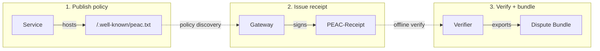

<p align="center">
  <a href="https://www.peacprotocol.org">
    <h1 align="center">PEAC Protocol</h1>
  </a>
</p>

<p align="center">
  <strong>Verifiable interaction records for AI agents and automated systems</strong>
  <br />
  A record is the portable interaction artifact; a receipt is the signed file format.
</p>

<p align="center">
  <a href="LICENSE"></a>
  <a href="https://github.com/peacprotocol/peac/releases"></a>
  <a href="https://www.npmjs.com/package/@peac/protocol"></a>
</p>

<p align="center">
  <a href="https://www.peacprotocol.org">Website</a> &middot;
  <a href="docs/SPEC_INDEX.md">Spec Index</a> &middot;
  <a href="https://github.com/peacprotocol/peac/discussions">Discussions</a> &middot;
  <a href="https://github.com/peacprotocol/peac/releases">Releases</a>
</p>

**What:** PEAC standardizes a file-discoverable policy surface and a signed receipt format that make automated interactions provable: consent, attribution, settlement references, decisions, outcomes.

**Who:** AI agents and agent platforms, APIs, gateways, tool servers, and compliance/security teams operating automated traffic across org boundaries.

**Why:** Internal logs don't travel and aren't neutral proof. PEAC makes terms machine-readable and outcomes verifiable, without replacing your auth, rails, or observability.

HTTP/REST is the primary binding today (receipt header + well-known policy). MCP mapping is implemented; A2A and streaming bindings are specified/planned. Verification is offline and deterministic.

## The model



1. **Publish policy**: Services publish terms and record requirements (`/.well-known/peac.txt`)
2. **Issue receipt**: Gateways issue signed receipts for governed interactions (identity, purpose, settlement, extensions)
3. **Verify + bundle**: Receipts verified offline; Dispute Bundles provide portable evidence for audits

## Where it fits

- HTTP APIs (paid or permissioned), tool invocations, dataset downloads, long-running sessions
- Cross-org audit evidence (security, compliance, billing disputes)
- Crawls, indexing, and AI training access with verifiable terms
- Safety, incident response, and governance workflows that need verifiable evidence (what terms applied, what was requested, what happened)

PEAC is the evidence layer. It does not replace identity, payment, or observability systems:

- **OpenTelemetry** is observability. PEAC is portable proof that can correlate to traces.
- **MCP / A2A** coordinate tool use and agent exchanges. PEAC carries proof alongside them.
- **AP2 / ACP / UCP** authorize and orchestrate commerce flows. PEAC provides verifiable evidence around those flows.
- **Payment rails** move funds. PEAC records settlement references and makes outcomes verifiable.

This repository contains the **reference TypeScript implementation** and a **Go SDK** ([sdks/go/](sdks/go/)).

---

## Principles

- **Neutral by design:** PEAC does not replace identity, payment rails, or observability. It records what happened in a portable format.
- **Offline-verifiable:** Verification is deterministic and can run without network access.
- **Interoperable:** Works alongside HTTP and MCP today; A2A and streaming bindings are specified/planned.
- **Privacy-aware:** Receipts are structured for auditability while supporting minimization and selective disclosure via bundles.
- **Open source:** Apache-2.0 licensed, designed for multiple independent implementations.

PEAC produces portable, verifiable evidence that can feed AI safety reviews, incident response, and governance workflows.

---

## Quick start

```bash
pnpm add @peac/protocol
```

Requires Node ESM or top-level await.

```typescript
import { issue, verifyLocal, generateKeypair } from '@peac/protocol';

// Generate a signing key
const { privateKey, publicKey } = await generateKeypair();

// Issue a receipt (minimal record)
const { jws } = await issue({
  iss: 'https://api.example.com',
  aud: 'https://client.example.com',
  subject: 'https://api.example.com/inference',
  privateKey,
  kid: 'key-2026-01',
});

// Verify with schema validation + binding checks
const result = await verifyLocal(jws, publicKey, {
  issuer: 'https://api.example.com',
  audience: 'https://client.example.com',
});

if (result.valid) {
  console.log('Verified:', result.claims.iss, result.claims.sub);
}
```

See [examples/quickstart/](examples/quickstart/) for runnable code. For settlement fields, HTTP/REST integration, Express middleware, and Go SDK examples, see [docs/README_LONG.md](docs/README_LONG.md).

---

## CLI

> **Note:** `@peac/cli` may not be published to npm yet. From this repo root: `pnpm install && pnpm --filter @peac/cli exec peac --help`.

```bash
peac verify 'eyJhbGc...'                # Verify a receipt
peac conformance run                     # Run conformance tests
peac conformance run --level full        # Full conformance suite
peac samples list                        # List sample receipts
peac policy init                         # Create peac-policy.yaml
peac policy validate policy.yaml         # Validate policy syntax
peac policy generate policy.yaml         # Compile to deployment artifacts
```

See [packages/cli/README.md](packages/cli/README.md) for the full command reference.

---

## Core primitives

**Stable** = wire identifiers and spec are stable and conformance-gated; implementations may evolve.

| Primitive           | Stable | Description                                           |
| ------------------- | ------ | ----------------------------------------------------- |
| Receipt envelope    | Yes    | `typ: peac-receipt/0.1`, Ed25519 JWS signature        |
| Receipt header      | Yes    | `PEAC-Receipt: <jws>`                                 |
| Policy surface      | Yes    | `/.well-known/peac.txt` access terms for agents       |
| Issuer config       | Yes    | `/.well-known/peac-issuer.json` JWKS discovery        |
| Verification report | Yes    | Deterministic JSON output from verify operations      |
| Dispute Bundle      | Yes    | ZIP with receipts + policy + report for offline audit |
| Workflow context    | Yes    | DAG correlation for multi-step agentic workflows      |
| Conformance vectors | Yes    | Golden inputs/outputs in `specs/conformance/`         |

---

## Versioning

Wire format identifiers (`peac-receipt/0.1`, `peac-bundle/0.1`) are independent of npm package versions and frozen for the v0.x series. Protocol surfaces (`PEAC-Receipt` header, `/.well-known/peac.txt`, `/.well-known/peac-issuer.json`) are stable. Implementation APIs (`@peac/protocol`, `@peac/cli`) aim for stability; internal packages may change between releases.

See [docs/specs/VERSIONING.md](docs/specs/VERSIONING.md) for the versioning doctrine.

---

## Security

- JWS signature verification required before trusting any receipt claim
- Key discovery via `/.well-known/peac-issuer.json` JWKS endpoints with SSRF guards and timeouts
- No silent network fallback for offline verification (fail-closed)
- Replay protection via nonce + timestamp validation
- Errors mapped to RFC 9457 Problem Details (no internal details exposed)

See [SECURITY.md](.github/SECURITY.md) and [docs/specs/PROTOCOL-BEHAVIOR.md](docs/specs/PROTOCOL-BEHAVIOR.md).

---

## Documentation

| Document                                               | Purpose                                           |
| ------------------------------------------------------ | ------------------------------------------------- |
| [Spec Index](docs/SPEC_INDEX.md)                       | Normative specifications                          |
| [Architecture](docs/ARCHITECTURE.md)                   | Kernel-first design                               |
| [Policy Kit Quickstart](docs/policy-kit/quickstart.md) | Policy authoring guide                            |
| [Engineering Guide](docs/engineering-guide.md)         | Development patterns                              |
| [CI Behavior](docs/CI_BEHAVIOR.md)                     | CI pipeline and gates                             |
| [Extended README](docs/README_LONG.md)                 | Package catalog, integration examples, layer maps |

---

## Contributing

Contributions are welcome. For substantial changes, please open an issue first to discuss the approach.

See `docs/SPEC_INDEX.md` for normative specifications and `docs/CI_BEHAVIOR.md` for CI guidelines.

---

## License

Apache-2.0. See [LICENSE](LICENSE). Contributions are licensed under Apache-2.0.

Stewardship: [Originary](https://www.originary.xyz/) and the open source community.

---

## Community

- **Source:** [https://github.com/peacprotocol/peac](https://github.com/peacprotocol/peac)
- **Website:** [https://www.peacprotocol.org](https://www.peacprotocol.org)
- **Issues:** Bug reports and feature requests via GitHub Issues
- **Discussions:** Design questions and ecosystem proposals via GitHub Discussions
- **Contact:** See [https://www.peacprotocol.org](https://www.peacprotocol.org) for working group and contact information

PEAC is designed for multiple independent implementations across languages and platforms. If you are building an implementation, SDK, or rail adapter, please open an issue so it can be linked from ecosystem documentation.
