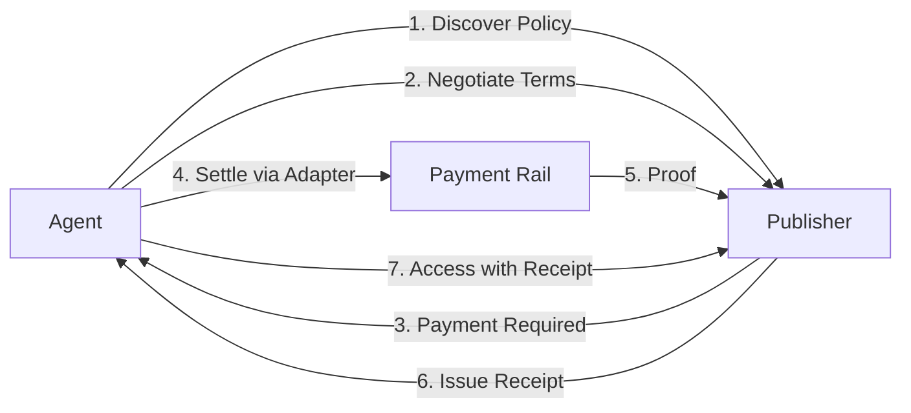

# PEAC Protocol

[](LICENSE)
[](https://github.com/peacprotocol/peac/releases)
[](docs/conformance.md)
[](docs/conformance.md)

**PEAC: Programmable Environment for Agent Coordination** (pronounced "peace")  
An open specification for machine-readable policies and agent coordination on the web.

PEAC defines a discoverable policy file (`/.well-known/peac.txt`, fallback `/peac.txt`) and HTTP headers (`x-peac-*`) that enable:

- access control,
- privacy and consent management,
- attribution requirements, and
- verifiable receipts with adapters for negotiation, settlement, and compliance across diverse systems.

Designed as neutral infrastructure: implement what you need, bridge what exists, and extend via adapters and PEIPs.
We build this collaboratively. Contribute adapters, propose PEIPs, and help shape the specification.

**Quick links:**  
[Getting Started](docs/getting-started.md) · [Protocol Spec](spec.md) · [Examples](docs/examples.md) · [Conformance](docs/conformance.md) · [PEIPs](docs/peips.md)

---

## Principles

- Neutrality. Server and client can interoperate without vendor lock-in.
- Simplicity. Text file discovery and clear HTTP behavior first.
- Extensibility. Adapters and PEIPs add new rails and formats without breaking core.
- Interoperability. Bridges for diverse stacks and ecosystems.

## Why Now?

The web is reaching a cooperative moment: autonomous agents, publishers, platforms, and regulators all benefit from clear, machine-readable policy. Modern standards (well-known URIs, Problem Details, DPoP) now make secure, verifiable interactions practical.

PEAC provides a neutral infrastructure layer that any system can adopt. Enabling policies, consent, attribution, and receipt-backed access across diverse systems. Agents get predictable terms; publishers get explicit control; platforms gain auditability; users and creators keep credit and privacy.

---

## At a Glance

- Discovery: `/.well-known/peac.txt` with fallback to `/peac.txt`.
- Version on wire: `version: 0.9.5` in `peac.txt` for this train.
- Headers: emit lowercase `x-peac-*` on the wire. Parsers should be case-insensitive.
- Media: `application/peac+json` for content, `application/problem+json` for errors.
- Conformance: L0–L4 (progressive; each level provides standalone value). See `docs/conformance.md`.

---

## Why PEAC

| Stakeholder                    | Value                                                                  |
| ------------------------------ | ---------------------------------------------------------------------- |
| Publishers and sites           | One file to declare terms, quotas, attribution, and consent.           |
| AI agents and libraries        | Discover, negotiate, settle with adapters, and fetch with receipts.    |
| Clouds, CDNs, and edge         | Enforce policy at the perimeter. Provide adapters as managed features. |
| Enterprises and APIs           | Purpose scoping, quotas, retention windows, and auditability.          |
| OSS developers and foundations | Stable core with clear extension points and a PEIP process.            |
| Major platforms                | Bridges to in-house protocols and standards engagement paths.          |
| Regulators and compliance      | Machine-readable policies with signed receipts for oversight.          |
| Individuals and small sites    | Simple deployment and predictable behavior with privacy defaults.      |
| Researchers and academics      | Testbed for agent coordination, datasets for evaluation and study.     |
| Ethical AI and safety groups   | Provenance and receipts that support transparency and oversight.       |

---

## Requirements

- Node 18 or newer.
- Any HTTP server or platform that can serve a static file.
- Production deployments SHOULD serve over HTTPS and set `Cache-Control` and `ETag` for `peac.txt`.
- Optional: TypeScript types are provided by packages under `@peacprotocol/*`.

---

## Quick Start

```bash
pnpm add -g @peacprotocol/cli @peacprotocol/core

npx peac init                 # scaffold peac.txt with defaults
npx peac validate peac.txt    # Expected: Valid PEAC 0.9.5 policy

# Preferred path
#   /.well-known/peac.txt
# Fallback path
#   /peac.txt

curl -I https://your-domain/.well-known/peac.txt  # check ETag and Cache-Control
```

Tips: emit lowercase `x-peac-*` headers, parse case-insensitively. Start in simulation via `PEAC_MODE=simulation`.  
Common pitfalls: invalid schema returns `application/problem+json` 400. Version mismatch returns 426 and `x-peac-protocol-version-supported`.

---

## Core Surfaces

- Discovery: `/.well-known/peac.txt` and fallback to `/peac.txt`.
- Headers on wire: lowercase `x-peac-*` such as `x-peac-protocol-version` and `x-peac-receipt`.
- Media: `application/peac+json` and `application/problem+json`.
- Caching: strong `ETag` and sensible `Cache-Control` for `peac.txt`.
- Conformance: L0 through L4 with fixtures and CI gates.

---

## Core Features

| Feature                    | Description                                                                                                                               |
| -------------------------- | ----------------------------------------------------------------------------------------------------------------------------------------- |
| Policy and entitlements    | File-based rules for free, paid, conditional, or prohibited access with quotas.                                                           |
| Consent and privacy        | Opt-in or opt-out signals, retention windows, links to policies.                                                                          |
| Attribution and provenance | Required attribution formats and verify-only provenance chains via adapters.                                                              |
| Negotiation and settlement | Programmatic terms, adapters for payment rails (**x402**, Stripe), and DPoP-bound receipts.                                               |
| Adapters and interop       | Bridges for MCP, A2A, payment rails such as **x402** and Stripe, Chainlink, peaq, and any payment provider via adapter. Extend via PEIPs. |
| HTTP semantics             | Lowercase `x-peac-*` on wire, Problem+JSON, and idempotency guidance.                                                                     |
| Conformance and tooling    | L0–L4 levels, CLI validation and fixtures, and ACID-style tests.                                                                          |

---

## Minimal peac.txt Example (0.9.5 wire)

```txt
# /.well-known/peac.txt
version: 0.9.5
usage: conditional

price: $0.001/request
currency: USD
payment_methods: [x402, stripe]  # any payment provider via adapter

attribution: required
attribution_format: "Source: {url}"

consent: optional
privacy_policy: https://example.com/privacy
data_retention: P30D
purposes: [research, commercial, training]

rate_limit: 1000/hour
free_quota: 100

negotiate: https://api.example.com/peac/negotiate
```

More examples are in `docs/examples.md` including free tier, metered, and research-only patterns.

---

## Integration Examples

### Publisher or API enforcement

```javascript
import { Parser } from "@peacprotocol/core";

const policy = await Parser.parse("https://example.com");

if (policy.requiresPayment("ai_training")) {
  // Offer negotiation and settlement via the configured adapter
}
```

### Agent access

```javascript
import { PEACClient } from "@peacprotocol/core";

const client = new PEACClient();
const access = await client.requestAccess("https://publisher.com", {
  purpose: "ai_training",
  volume: "10GB",
  adapter: "mcp",
});

if (access.granted) {
  const resp = await fetch("https://publisher.com/data", {
    headers: { "x-peac-receipt": access.receipt.id },
  });
}
```

---

## HTTP Semantics and Samples

**426 Upgrade Required** with Problem+JSON

```json
{
  "type": "about:blank",
  "title": "Upgrade Required",
  "status": 426,
  "detail": "Unsupported protocol version.",
  "supported": ["0.9.5"]
}
```

**Receipt example**

```json
{
  "id": "peac_receipt_01HXYZ",
  "issuer": "https://publisher.example",
  "subject": "agent-123",
  "purpose": "ai_training",
  "terms_hash": "sha256-...",
  "amount": "5.00",
  "currency": "USD",
  "method": "x402",
  "dpop_proof": "eyJhbGciOiJIUzI1NiIs...",
  "issued_at": "2025-08-16T00:00:00Z",
  "expires_at": "2025-08-17T00:00:00Z",
  "signature": "0x..."
}
```

---

## Use Cases

| Scenario                      | Description & Value                                                                                           |
| ----------------------------- | ------------------------------------------------------------------------------------------------------------- |
| AI data licensing             | Site terms for training or commercial use with compliant, auditable receipts.                                 |
| Web scraping control          | Quotas and attribution for automated clients with predictable server behavior.                                |
| Commercial API access         | Tiers and quotas via adapters with enforcement at the edge and origin.                                        |
| IoT and device sharing        | Consent and retention signals for DePIN adapters including peaq.                                              |
| Regulatory compliance         | Machine-readable policies and receipts to support audits and investigations.                                  |
| Agent commerce (experimental) | Automated discovery, negotiation, and settlement via adapters. **Currently experimental in simulation mode.** |

---

## Conformance

| Level | Scope summary                                  |
| ----: | ---------------------------------------------- |
|    L0 | Discover and parse `peac.txt`.                 |
|    L1 | Emit and accept headers and Problem+JSON.      |
|    L2 | Quotas and purpose scoping.                    |
|    L3 | Negotiate and settle via adapter and receipts. |
|    L4 | End-to-end auditability and provenance.        |

Run locally: `pnpm run conf:test -- --level L0`  
See `docs/interop.md` for adapter and feature status.

---

## Typical Implementation Path

Each phase is optional and valuable on its own; start at L0 and proceed as needed.

1. **Phase 1 — L0 Discovery**: Serve and validate `peac.txt`.
2. **Phase 2 — L1 HTTP Semantics**: Add headers, Problem+JSON, and version signaling.
3. **Phase 3 — L2 Controls**: Define and enforce purposes, quotas, and retention.
4. **Phase 4 — L3 Simulation**: Negotiate and issue receipts in simulation via an adapter.
5. **Phase 5 — L3 Production**: Enable a production payment adapter and receipts.
6. **Phase 6 — L4 Provenance**: Connect verify-only provenance chains for end-to-end auditability.

---

## Adapters and Extensions

Adapters connect PEAC to payment rails, agent protocols, provenance systems, and chains. The lifecycle is simulation to staging to production. Contribute new designs via PEIPs. See `docs/peips/PEIP-TEMPLATE.md`.

---

## Templates and Deploy Snippets

**Cloudflare Worker**

```javascript
export default {
  async fetch(req, env) {
    const url = new URL(req.url);
    if (
      url.pathname === "/.well-known/peac.txt" ||
      url.pathname === "/peac.txt"
    ) {
      return new Response(env.PEAC_TXT, {
        headers: {
          "content-type": "text/plain; charset=utf-8",
          "cache-control": "public, max-age=600",
        },
      });
    }
    return new Response("Not found", { status: 404 });
  },
};
```

**NGINX**

```nginx
location = /.well-known/peac.txt {
  add_header Content-Type text/plain;
  add_header Cache-Control "public, max-age=600";
  try_files /peac.txt =404;
}
```

More templates are in `docs/templates.md`.

---

## Troubleshooting

- 426 Upgrade Required. Check `x-peac-protocol-version-supported` and set `x-peac-protocol-version: 0.9.5`.
- 400 Problem+JSON. Validate `peac.txt` or the negotiation body.
- Missing receipt. Ensure the adapter completed settlement. On success the server can return `x-peac-receipt` and a receipt body.
- Header mismatch. Emit lowercase `x-peac-*`. Intermediaries may alter casing.
- Negotiation fails. Enable flags like `PEAC_FEATURE_NEGOTIATION=1` and start with a simulation adapter.

---

## Protocol Flow



Alternative ASCII view:

```
Discovery:    Agent ----> Publisher (/.well-known/peac.txt)
Negotiation:  Agent <--> Publisher (terms and conditions)
Settlement:   Agent ----> Payment Rail ----> Publisher
Receipt:      Publisher ----> Agent (signed receipt)
Access:       Agent ----> Publisher (with receipt header)
```

---

## Versioning and Compatibility

- Current train: `version: 0.9.5` in `peac.txt`.
- New behavior is behind feature flags or marked experimental until stable.

---

## Standards Path and Working Group

Working toward drafts for IETF and W3C where appropriate.  
Join the working group: https://peacprotocol.org/wg

## Governance (planned)

We are exploring a neutral, multi-stakeholder governance model (e.g., a foundation or steering group) to steward the specification. Details will be proposed in the open via PEIPs and community discussion. Organizations interested in participating can reach out via contact@peacprotocol.org or the Working Group page.

---

## Security

PEAC takes security seriously. Implementations should validate receipts cryptographically, use DPoP for proof of possession where applicable, apply rate limiting per policy, and follow coordinated disclosure. See `SECURITY.md`.

---

## References

- RFC 9110 HTTP Semantics
- RFC 7807 Problem Details for HTTP APIs
- RFC 9449 Demonstrating Proof of Possession at the Application Layer
- RFC 2119 and RFC 8174 requirement keywords
- robots.txt and related conventions

---

## Documentation

- [Getting Started](docs/getting-started.md)
- [Protocol Specification](spec.md)
- [API Reference](docs/api-reference.md)
- [Compliance Guide](docs/compliance-guide.md)
- [Engineering Guide](docs/engineering-guide.md)
- [Conformance](docs/conformance.md)
- [Interop Matrix](docs/interop.md)
- [Templates](docs/templates.md)
- [Receipt Schema](docs/receipt.md)
- [Problem Catalog](docs/problems.md)
- [PEIPs](docs/peips.md)
- [Security Policy](SECURITY.md)

---

## Community

- Working Group: open participation; see the WG page for announcements
- Discussions: GitHub Discussions for questions, proposals, and examples
- Contributing: see `CONTRIBUTING.md`
- Contact: contact@peacprotocol.org
- See the Working Group for involvement opportunities.

---

## Contributing

Issues, pull requests, and PEIPs are welcome. See `CONTRIBUTING.md`.

---

## License

Apache 2.0. See `LICENSE`.
