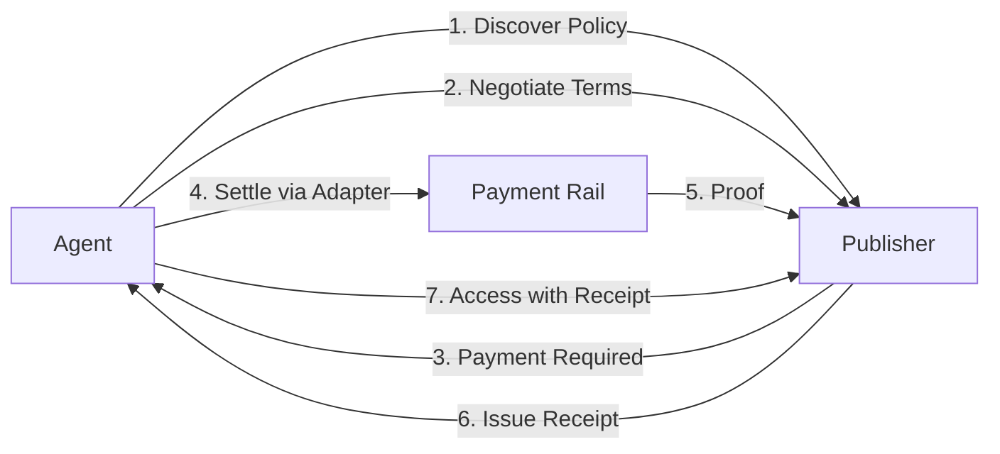

# PEAC Protocol

[](LICENSE)
[](https://github.com/peacprotocol/peac/releases)
[](https://github.com/peacprotocol/peac/actions/workflows/ci-lite.yml)
[](https://github.com/peacprotocol/peac/actions/workflows/codeql.yml)

**PEAC: Programmable Environment for Agent Coordination** (pronounced "peace")

PEAC is a minimal, open spec for machine-readable policy and agent coordination on the web:

- **Discovery** via `/.well-known/peac.txt`
- **HTTP semantics** via `PEAC-Receipt` headers and HTTP Problem Details (RFC 7807)
- **Verifiable receipts** (JWS) with **adapters** for negotiation, settlement, and compliance
- **Trust rails** for agents: UDA, DPoP, and Agent Attestation

Designed as neutral infrastructure: implement what you need, bridge what exists, and extend via adapters and PEIPs.
We build this collaboratively. Contribute adapters, propose PEIPs, and help shape the specification.

**Quick links:**
[Getting Started](docs/getting-started.md) · [Protocol Spec](spec.md) · [Examples](docs/examples.md) · [Conformance](docs/conformance.md) · [Adapters](docs/interop.md) · [PEIPs](docs/peips.md)

---

## Principles

- Neutrality. Server and client can interoperate without vendor lock-in.
- Simplicity. Text file discovery and clear HTTP behavior first.
- Extensibility. Adapters and PEIPs add new rails and formats without breaking core.
- Interoperability. Bridges for diverse stacks and ecosystems.

## Why Now?

Autonomous clients need predictable, auditable policy and trust rails. With well-known URIs, Problem+JSON, DPoP, and modern JOSE, the web finally has the pieces to coordinate access, consent, attribution and settlement. PEAC stitches these together-minimally-so anyone can adopt them.

---

## At a glance

- **Discovery:** `/.well-known/peac.txt` (fallback `/peac.txt`)
- **Wire version:** `0.9.14` (JWS header `typ: "peac.receipt/0.9"`)
- **Headers:** Single `PEAC-Receipt` header; parsers MUST treat header names case-insensitively
- **Media:** `application/peac+json` (content), `application/problem+json` (errors), `application/jwk-set+json` (JWKS)
- **Receipts:** JWS with `typ: "peac.receipt/0.9"`, `iat` field (Unix seconds), `payment.scheme`
- **Trust:** UDA (JWT with `typ: "JWT"`), DPoP proofs bound to `cnf.jkt`, optional agent attestation header
- **Conformance:** Levels L0-L4; see [docs/conformance.md](docs/conformance.md)

---

## Ecosystem roles & value

| Role                          | Value                                                                                               |
| ----------------------------- | --------------------------------------------------------------------------------------------------- |
| Publishers / Sites            | One file to declare terms, quotas, attribution, and consent; predictable enforcement with receipts. |
| Agent developers & libraries  | Discover policies, negotiate/settle via adapters, and fetch with verifiable receipts.               |
| Clouds / CDNs / Edge          | Enforce policy at the perimeter and offer managed adapters.                                         |
| Enterprises / APIs            | Purpose scoping, quotas, retention windows, and auditability.                                       |
| OSS maintainers & foundations | Minimal core with clear extension points; propose changes via PEIPs.                                |
| Platforms                     | Bridges to existing protocols and standards engagement paths.                                       |
| Regulators & compliance       | Machine-readable policies plus signed receipts for oversight.                                       |
| Individual site owners        | Simple deployment with privacy-respecting defaults.                                                 |
| Researchers & academics       | Testbed for agent coordination; datasets for evaluation and study.                                  |
| Ethics & safety communities   | Provenance and receipts that support transparency and oversight.                                    |

## Requirements

- Node 18 or newer.
- Any HTTP server or platform that can serve a static file.
- Production deployments SHOULD serve over HTTPS and set `Cache-Control` and `ETag` for `peac.txt`.
- Optional: TypeScript types are provided by packages under `@peacprotocol/*`.

---

## Quick start

```bash
pnpm add -g @peacprotocol/cli @peacprotocol/core

npx peac init                 # scaffold peac.txt with defaults
npx peac validate peac.txt    # Expected: Valid PEAC 0.9.13 policy

# Preferred path
#   /.well-known/peac.txt
# Fallback path
#   /peac.txt

curl -I https://your-domain/.well-known/peac.txt  # check ETag + Cache-Control
```

Tips: emit `PEAC-Receipt` header; be case-insensitive on read. Start in simulation via `PEAC_MODE=simulation`.
Common pitfalls: invalid schema returns HTTP Problem Details (RFC 7807) 400.

---

## Core surfaces

- **Discovery**: `/.well-known/peac.txt` (fallback `/peac.txt`)
- **Headers**: `PEAC-Receipt`, `peac-agent-attestation`, etc.
- **Errors**: HTTP Problem Details (RFC 7807) with stable catalog
- **Caching**: strong `ETag`, sensible `Cache-Control` for `peac.txt` and well-known endpoints

---

## Core Features

| Feature                    | Description                                                                                                                                          |
| -------------------------- | ---------------------------------------------------------------------------------------------------------------------------------------------------- |
| Receipt engine             | Core orchestration function `enforce()` implementing discover, evaluate, settle, prove workflow.                                                     |
| Policy and entitlements    | File-based rules for free, paid, conditional, or prohibited access with quotas.                                                                      |
| Consent and privacy        | Opt-in or opt-out signals, retention windows, links to policies.                                                                                     |
| Attribution and provenance | Required attribution formats and verify-only provenance chains via adapters.                                                                         |
| Negotiation and settlement | Programmatic terms, adapters for payment rails (**x402**, **L402**, Stripe), and DPoP-bound receipts.                                                |
| Agent trust rails          | UDA (OAuth Device Flow), DPoP proof-of-possession, agent attestation verification for autonomous coordination.                                       |
| Receipts v2                | JWS with `typ: "peac.receipt/0.9"`; JCS canonicalization for verifiable settlements.                                                                 |
| JWKS management            | 30-day key rotation, 7-day grace periods, `application/jwk-set+json` with ETag caching.                                                              |
| Adapters and interop       | Bridges for MCP, A2A, payment rails such as **x402**, **L402**, and Stripe, Chainlink, peaq, and any payment provider via adapter. Extend via PEIPs. |
| HTTP semantics             | `PEAC-Receipt` header, RFC9457 Problem Details, and idempotency guidance.                                                                            |
| Conformance and tooling    | L0-L4 levels, CLI validation and fixtures, and ACID-style tests.                                                                                     |

---

## Minimal `peac.txt` (docs train 0.9.13, wire 0.9.13)

```txt
# /.well-known/peac.txt
version: 0.9.13
usage: conditional

price: $0.001/request
currency: USD
payment_methods: [x402, l402, stripe]   # any payment rail via adapter

attribution: required
attribution_format: "Source: {url}"

consent: optional
privacy_policy: https://example.com/privacy
data_retention: P30D
purposes: [research, commercial, training]

rate_limit: 1000/hour
free_quota: 100

negotiate: https://api.example.com/peac/negotiate
```

More examples: [docs/examples.md](docs/examples.md)

---

## Agent trust rails

- **UDA (User-Delegated Access)**
  Issued via OAuth Device Flow; JWT with `typ: "JWT"`. Bind to agent key (`cnf.jkt`) where required.

- **DPoP**
  Required on protected endpoints; per-request proof; replay protection recommended (e.g., Redis).

- **Agent Attestation**
  Optional header `peac-agent-attestation`; verifiable provenance of the agent runtime and policy.

---

## Receipts (detached JWS)

- Media type `typ: "peac.receipt/0.9"`
- JCS canonicalization of payload before signing
- Verification via detached JWS (no payload bloat in transit)

---

## Adapters & interop

Adapters bridge PEAC to payment rails, agent protocols, provenance, and chains. Lifecycle: simulation → staging → production.

| Adapter    | Status (0.9.13) | Notes                                     |
| ---------- | --------------- | ----------------------------------------- |
| **MCP**    | Stable          | Agent protocol adapter                    |
| **A2A**    | Beta            | Agent-to-Agent negotiation                |
| **x402**   | Stable          | Payment rail                              |
| **Stripe** | Preview         | Payment rail (mock adapter)               |
| **L402**   | Preview         | Lightning Network payments (mock adapter) |
| Chainlink  | Preview         | Oracle/provenance integrations            |
| peaq       | Preview         | DePIN/IoT sharing + receipts              |

Details & examples: [docs/interop.md](docs/interop.md) · Propose new adapters via [PEIPs](docs/peips.md)

---

## Integration Examples

### Publisher or API enforcement

```javascript
import { Parser } from '@peacprotocol/core';

const policy = await Parser.parse('https://example.com');

if (policy.requiresPayment('ai_training')) {
  // Offer negotiation and settlement via the configured adapter
}
```

### Agent access

```javascript
import { PEACClient } from '@peacprotocol/core';

const client = new PEACClient();
const access = await client.requestAccess('https://publisher.com', {
  purpose: 'ai_training',
  volume: '10GB',
  adapter: 'mcp',
});

if (access.granted) {
  const resp = await fetch('https://publisher.com/data', {
    headers: { 'PEAC-Receipt': access.receipt.id },
  });
}
```

---

## HTTP semantics & samples

**Example API request with curl:**

```bash
curl -X POST https://demo.peacprotocol.org/agreements \
  -H "content-type: application/json" \
  -H "x-api-key: your-key" \
  -d '{
    "capabilities": ["read", "summarize"],
    "max_charge": "5.00",
    "currency": "USD"
  }'
```

**JavaScript example:**

```javascript
const response = await fetch('https://demo.peacprotocol.org/agreements', {
  method: 'POST',
  headers: {
    'content-type': 'application/json',
    'x-api-key': apiKey,
  },
  body: JSON.stringify({
    capabilities: ['read', 'summarize'],
    max_charge: '5.00',
    currency: 'USD',
  }),
});
```

**400 Bad Request** (validation error)

```json
{
  "type": "https://peacprotocol.org/problems/validation-error",
  "title": "Bad Request",
  "status": 400,
  "detail": "Invalid peac.txt schema"
}
```

**Receipt (payload excerpt)**

```json
{
  "id": "peac_receipt_01HXYZ",
  "issuer": "https://publisher.example",
  "subject": "agent-123",
  "purpose": "ai_training",
  "terms_hash": "sha256-...",
  "amount": "5.00",
  "currency": "USD",
  "method": "x402",
  "issued_at": "2025-08-16T00:00:00Z",
  "expires_at": "2025-08-17T00:00:00Z"
}
```

---

## Use Cases

| Scenario                      | Description & Value                                                                                           |
| ----------------------------- | ------------------------------------------------------------------------------------------------------------- |
| AI data licensing             | Site terms for training or commercial use with compliant, auditable receipts.                                 |
| Web scraping control          | Quotas and attribution for automated clients with predictable server behavior.                                |
| Commercial API access         | Tiers and quotas via adapters with enforcement at the edge and origin.                                        |
| IoT and device sharing        | Consent and retention signals for DePIN adapters including peaq.                                              |
| Regulatory compliance         | Machine-readable policies and receipts to support audits and investigations.                                  |
| Agent commerce (experimental) | Automated discovery, negotiation, and settlement via adapters. **Currently experimental in simulation mode.** |

---

## Conformance

| Level | Scope summary                              |
| ----: | ------------------------------------------ |
|    L0 | Discover and parse `peac.txt`.             |
|    L1 | Headers + Problem+JSON.                    |
|    L2 | Quotas and purpose scoping.                |
|    L3 | Negotiate & settle via adapter + receipts. |
|    L4 | Audit/provenance (attestation + receipts). |

Run: `pnpm run conf:test -- --level L0`
Matrix: [docs/interop.md](docs/interop.md) · Levels & tests: [docs/conformance.md](docs/conformance.md)

---

## Typical implementation path

1. **L0 Discovery** → serve & validate `peac.txt`
2. **L1 HTTP** → add headers, Problem+JSON, version signaling
3. **L2 Controls** → purposes, quotas, retention
4. **L3 Simulation** → negotiation + receipts via adapter
5. **L3 Production** → enable a production payment rail
6. **L4 Provenance** → attestation + end-to-end receipts

---

## Adapters and Extensions

Adapters connect PEAC to payment rails, agent protocols, provenance systems, and chains. The lifecycle is simulation to staging to production. Contribute new designs via PEIPs. See `docs/peips/PEIP-TEMPLATE.md`.

---

## Templates and Deploy Snippets

**Cloudflare Worker**

```javascript
export default {
  async fetch(req, env) {
    const url = new URL(req.url);
    if (url.pathname === '/.well-known/peac.txt' || url.pathname === '/peac.txt') {
      return new Response(env.PEAC_TXT, {
        headers: {
          'content-type': 'text/plain; charset=utf-8',
          'cache-control': 'public, max-age=600',
        },
      });
    }
    return new Response('Not found', { status: 404 });
  },
};
```

**NGINX**

```nginx
location = /.well-known/peac.txt {
  add_header Content-Type text/plain;
  add_header Cache-Control "public, max-age=600";
  try_files /peac.txt =404;
}
```

More templates are in `docs/templates.md`.

---

## Troubleshooting

- 400 HTTP Problem Details (RFC 7807). Validate `peac.txt` or the negotiation body.
- Missing receipt. Ensure the adapter completed settlement. On success the server can return `PEAC-Receipt` and a receipt body.
- Header mismatch. Emit `PEAC-Receipt`. Intermediaries may alter casing.
- Negotiation fails. Enable flags like `PEAC_FEATURE_NEGOTIATION=1` and start with a simulation adapter.

---

## Protocol Flow



Alternative ASCII view:

```
Discovery:    Agent ----> Publisher (/.well-known/peac.txt)
Negotiation:  Agent <--> Publisher (terms and conditions)
Settlement:   Agent ----> Payment Rail ----> Publisher
Receipt:      Publisher ----> Agent (signed receipt)
Access:       Agent ----> Publisher (with receipt header)
```

---

## Versioning and Compatibility

- Current train: `version: 0.9.13` in `peac.txt`.
- New behavior is behind feature flags or marked experimental until stable.

---

## Standards path & governance

We target IETF/W3C venues where appropriate (HTTP, JOSE, provenance).
Join the working group: [peacprotocol.org/wg](https://peacprotocol.org/wg) · See [docs/peips.md](docs/peips.md)

## Governance (planned)

We are exploring a neutral, multi-stakeholder governance model (e.g., a foundation or steering group) to steward the specification. Details will be proposed in the open via PEIPs and community discussion. Organizations interested in participating can reach out via contact@peacprotocol.org or the Working Group page.

---

## Security

Validate receipts cryptographically, enforce DPoP where applicable, rate-limit per policy, and follow coordinated disclosure.
See [SECURITY.md](SECURITY.md) and [docs/security.md](docs/security.md).

---

## References

- RFC 9110 HTTP Semantics
- RFC 7807 Problem Details for HTTP APIs
- RFC 9449 Demonstrating Proof of Possession at the Application Layer
- RFC 2119 and RFC 8174 requirement keywords
- robots.txt and related conventions

---

## Documentation

- [Getting Started](docs/getting-started.md)
- [Protocol Specification](spec.md)
- [API Reference](docs/api-reference.md)
- [Compliance Guide](docs/compliance-guide.md)
- [Engineering Guide](docs/engineering-guide.md)
- [Conformance](docs/conformance.md)
- [Interop Matrix](docs/interop.md)
- [Templates](docs/templates.md)
- [Receipt Schema](docs/receipt.md)
- [HTTP Semantics](docs/http.md)
- [UDA](docs/uda.md)
- [Agent Attestation](docs/attestation.md)
- [Security](docs/security.md)
- [Problem Catalog](docs/problems.md)
- [PEIPs](docs/peips.md)
- [Roadmap](docs/roadmap.md)
- [Vision](docs/vision.md)

---

## Community & contributing

- Working Group: open participation; see the WG page
- Discussions: GitHub Discussions for proposals and Q&A
- Contributing: see [CONTRIBUTING.md](CONTRIBUTING.md)
- Contact: [contact@peacprotocol.org](mailto:contact@peacprotocol.org)

**License:** Apache 2.0 (see [LICENSE](LICENSE))
