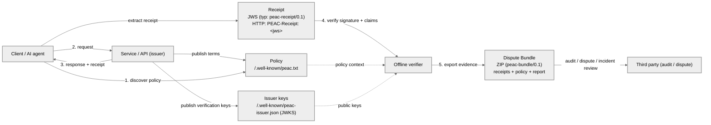

<p align="center">
  <a href="https://www.peacprotocol.org">
    <h1 align="center">PEAC Protocol</h1>
  </a>
</p>

<p align="center">
  <strong>Verifiable interaction records for AI agents and automated systems</strong>
  <br />
  A record is the portable interaction artifact; a receipt is the signed file format.
</p>

<p align="center">
  <a href="LICENSE"></a>
  <a href="https://github.com/peacprotocol/peac/releases"></a>
  <a href="https://www.npmjs.com/package/@peac/protocol"></a>
  <a href="https://github.com/peacprotocol/peac/actions/workflows/ci.yml"></a>
</p>

<p align="center">
  <a href="https://www.peacprotocol.org">Website</a> &middot;
  <a href="docs/SPEC_INDEX.md">Spec Index</a> &middot;
  <a href="https://github.com/peacprotocol/peac/discussions">Discussions</a> &middot;
  <a href="https://github.com/peacprotocol/peac/releases">Releases</a>
</p>

**What:** PEAC standardizes a file-discoverable policy surface and a signed receipt format that make automated interactions provable: consent, attribution, settlement references, decisions, outcomes.

**Who:** AI agents and agent platforms, APIs, gateways, tool servers, and compliance/security teams operating automated traffic across org boundaries.

**Why:** Internal logs don't travel and aren't neutral proof. PEAC makes terms machine-readable and outcomes verifiable, without replacing your auth, rails, or observability.

HTTP/REST is the primary binding today (receipt header + well-known policy). MCP mapping is implemented; A2A and streaming bindings are specified/planned. Verification is offline and deterministic.

## Why PEAC exists

**The problem:** AI agents and automated systems operate across organizational boundaries, but proof of what happened stays locked in internal logs. When disputes arise—billing errors, policy violations, safety incidents—there's no neutral, portable evidence that both parties can verify.

**Traditional approaches:**

- **Internal logs** - Not portable, not verifiable by third parties
- **API observability** - Captures _how_ systems behave, not _what terms applied_
- **Audit trails** - Vendor-specific, can't be independently verified offline

**PEAC's approach:** Standardize machine-readable policies and cryptographically signed receipts that create verifiable evidence at interaction time. Verification is offline and deterministic—no trust in the issuer's live systems required.

**Result:** Security teams get verifiable evidence for incident response. Compliance teams can prove what terms applied. Billing disputes resolve with cryptographic proof. AI safety reviews have portable artifacts to analyze.

## The model



**The proof flow (per interaction):**

1. **Discover policy** - Agent reads `/.well-known/peac.txt` before making requests (machine-readable terms)
2. **Make request** - Client/agent calls API, tool, or dataset endpoint
3. **Receive signed receipt** - Service returns `PEAC-Receipt: <jws>` header with response (cryptographic proof of interaction)
4. **Verify offline** - Verifier checks JWS signature + claims using issuer's public keys (deterministic, no network required)
5. **Export evidence** - Bundle receipts + policy + verification report into portable `.zip` for audits, disputes, or incident review

**Setup (out of band):** Service publishes policy at `/.well-known/peac.txt` and verification keys at `/.well-known/peac-issuer.json`.

**Why this matters:** Internal logs don't travel across org boundaries. PEAC makes terms machine-readable and outcomes cryptographically verifiable.

## Where it fits

- HTTP APIs (paid or permissioned), tool invocations, dataset downloads, long-running sessions
- Cross-org audit evidence (security, compliance, billing disputes)
- Crawls, indexing, and AI training access with verifiable terms
- Safety, incident response, and governance workflows that need verifiable evidence (what terms applied, what was requested, what happened)

**Complements existing systems:**

- **OpenTelemetry** - Observability traces; PEAC adds portable proof that correlates to those traces
- **MCP / A2A** - Tool coordination and agent exchanges; PEAC carries verifiable evidence alongside
- **AP2 / ACP / UCP** - Commerce authorization and orchestration; PEAC provides cryptographic proof of outcomes
- **Payment rails** - Fund movement; PEAC records settlement references and makes outcomes verifiable

This repository contains the **reference TypeScript implementation** and a **Go SDK** ([sdks/go/](sdks/go/)).

---

## PEAC vs. alternatives

| Concern                    | Internal Logs                  | PEAC Receipts                               |
| -------------------------- | ------------------------------ | ------------------------------------------- |
| **Portability**            | Locked in vendor systems       | Portable across orgs                        |
| **Verifiability**          | Trust the log owner            | Cryptographic proof (offline)               |
| **Dispute resolution**     | "My logs vs. your logs"        | Neutral evidence both parties verify        |
| **Machine-readable terms** | Human docs, maybe OpenAPI      | `/.well-known/peac.txt` for agent discovery |
| **Interoperability**       | Vendor-specific formats        | Open spec, multiple implementations         |
| **Privacy**                | Full request/response captured | Structured claims (supports minimization)   |
| **Replaces auth/payment?** | N/A                            | No—complements existing rails               |

PEAC is the **evidence layer**. It records what happened in a format that survives organizational boundaries.

---

## Principles

- **Neutral by design:** Records what happened in a portable, verifiable format
- **Offline-verifiable:** Verification is deterministic and can run without network access
- **Interoperable:** Works alongside HTTP and MCP today; A2A and streaming bindings are specified/planned
- **Privacy-aware:** Receipts are structured for auditability while supporting minimization and selective disclosure via bundles
- **Open source:** Apache-2.0 licensed, designed for multiple independent implementations

**Non-goals:** PEAC is not an auth system, not a payment rail, not observability infrastructure. It is the evidence layer that complements these systems.

PEAC produces portable, verifiable evidence that can feed AI safety reviews, incident response, and governance workflows.

---

## Quick start

**Requirements:** Node >= 20

```bash
pnpm add @peac/protocol
```

### Issue and verify a receipt

```typescript
import { issue, verifyLocal, generateKeypair } from '@peac/protocol';

// Generate a signing key
const { privateKey, publicKey } = await generateKeypair();

// Issue a receipt (minimal record)
const { jws } = await issue({
  iss: 'https://api.example.com',
  aud: 'https://client.example.com',
  subject: 'https://api.example.com/inference',
  privateKey,
  kid: 'key-2026-01',
});

// Verify with schema validation + binding checks
const result = await verifyLocal(jws, publicKey, {
  issuer: 'https://api.example.com',
  audience: 'https://client.example.com',
});

if (result.valid) {
  console.log('Verified:', result.claims.iss, result.claims.sub);
}
```

### Verify an existing receipt (CLI)

```bash
peac verify 'eyJhbGciOiJFZERTQSIsInR5cCI6InBlYWMtcmVjZWlwdC8wLjEifQ...'
```

See [examples/quickstart/](examples/quickstart/) for runnable code. For settlement fields, HTTP/REST integration, Express middleware, and Go SDK examples, see [docs/README_LONG.md](docs/README_LONG.md).

---

## Choose your path

| You are...                          | Start here                                                                         |
| ----------------------------------- | ---------------------------------------------------------------------------------- |
| **Building an AI agent**            | [Quick start](#quick-start) → Issue/verify receipts in 5 lines                     |
| **Running an API that agents call** | [Express middleware](docs/README_LONG.md#express-middleware) → Add PEAC in 3 lines |
| **Implementing in Go**              | [Go SDK](sdks/go/) → `peac.Issue()` + `peac.Verify()`                              |
| **Writing policy files**            | [Policy Kit Quickstart](docs/policy-kit/quickstart.md) → Author + validate terms   |
| **Auditing/compliance role**        | [Dispute Bundles](#core-primitives) → Portable evidence format                     |
| **Integrating with your protocol**  | [Spec Index](docs/SPEC_INDEX.md) → Normative specifications                        |

---

## CLI

> **Note:** `@peac/cli` may not be published to npm yet. From this repo root: `pnpm install && pnpm --filter @peac/cli exec peac --help`.

```bash
peac verify 'eyJhbGc...'                # Verify a receipt
peac conformance run                     # Run conformance tests
peac conformance run --level full        # Full conformance suite
peac samples list                        # List sample receipts
peac policy init                         # Create peac-policy.yaml
peac policy validate policy.yaml         # Validate policy syntax
peac policy generate policy.yaml         # Compile to deployment artifacts
```

See [packages/cli/README.md](packages/cli/README.md) for the full command reference.

---

## Core primitives

**Stable** = wire identifiers and spec are stable and conformance-gated; implementations may evolve.

| Primitive           | Stable | Description                                           |
| ------------------- | ------ | ----------------------------------------------------- |
| Receipt envelope    | Yes    | `typ: peac-receipt/0.1`, Ed25519 JWS signature        |
| Receipt header      | Yes    | `PEAC-Receipt: <jws>`                                 |
| Policy surface      | Yes    | `/.well-known/peac.txt` access terms for agents       |
| Issuer config       | Yes    | `/.well-known/peac-issuer.json` JWKS discovery        |
| Verification report | Yes    | Deterministic JSON output from verify operations      |
| Dispute Bundle      | Yes    | ZIP with receipts + policy + report for offline audit |
| Workflow context    | Yes    | DAG correlation for multi-step agentic workflows      |
| Conformance vectors | Yes    | Golden inputs/outputs in `specs/conformance/`         |

---

## Versioning

Wire format identifiers (`peac-receipt/0.1`, `peac-bundle/0.1`) are independent of npm package versions and frozen for the v0.x series. Protocol surfaces (`PEAC-Receipt` header, `/.well-known/peac.txt`, `/.well-known/peac-issuer.json`) are stable. Implementation APIs (`@peac/protocol`, `@peac/cli`) aim for stability; internal packages may change between releases.

See [docs/specs/VERSIONING.md](docs/specs/VERSIONING.md) for the versioning doctrine.

---

## Security

- JWS signature verification required before trusting any receipt claim
- Key discovery via `/.well-known/peac-issuer.json` JWKS endpoints with SSRF guards and timeouts
- No silent network fallback for offline verification (fail-closed)
- Replay protection via nonce + timestamp validation
- Errors mapped to RFC 9457 Problem Details (no internal details exposed)

See [SECURITY.md](.github/SECURITY.md) and [docs/specs/PROTOCOL-BEHAVIOR.md](docs/specs/PROTOCOL-BEHAVIOR.md).

---

## Documentation

| Document                                               | Purpose                                           |
| ------------------------------------------------------ | ------------------------------------------------- |
| [Spec Index](docs/SPEC_INDEX.md)                       | Normative specifications                          |
| [Architecture](docs/ARCHITECTURE.md)                   | Kernel-first design                               |
| [Policy Kit Quickstart](docs/policy-kit/quickstart.md) | Policy authoring guide                            |
| [Engineering Guide](docs/engineering-guide.md)         | Development patterns                              |
| [CI Behavior](docs/CI_BEHAVIOR.md)                     | CI pipeline and gates                             |
| [Extended README](docs/README_LONG.md)                 | Package catalog, integration examples, layer maps |

---

## Contributing

Contributions are welcome. For substantial changes, please open an issue first to discuss the approach.

See `docs/SPEC_INDEX.md` for normative specifications and `docs/CI_BEHAVIOR.md` for CI guidelines.

---

## License

Apache-2.0. See [LICENSE](LICENSE). Contributions are licensed under Apache-2.0.

Stewardship: [Originary](https://www.originary.xyz/) and the open source community.

---

## Implementations

<p align="center">
  <a href="https://star-history.com/#peacprotocol/peac&Date">
    
  </a>
</p>

- **TypeScript** (this repo) - `@peac/protocol`, `@peac/cli`, `@peac/sdk-js`
- **Go** - [sdks/go/](sdks/go/) native implementation
- **MCP servers** - [MCP adapter](packages/adapter-mcp/) for Model Context Protocol
- **HTTP middleware** - [Express](packages/middleware/express/), [Hono](packages/middleware/hono/) adapters

Building an implementation? [Open an issue](https://github.com/peacprotocol/peac/issues/new) to be listed in ecosystem docs.

---

## Community

- **Source:** [https://github.com/peacprotocol/peac](https://github.com/peacprotocol/peac)
- **Website:** [https://www.peacprotocol.org](https://www.peacprotocol.org)
- **Issues:** Bug reports and feature requests via GitHub Issues
- **Discussions:** Design questions and ecosystem proposals via GitHub Discussions
- **Contact:** See [https://www.peacprotocol.org](https://www.peacprotocol.org) for working group and contact information

PEAC is designed for multiple independent implementations across languages and platforms. If you are building an implementation, SDK, or rail adapter, please open an issue so it can be linked from ecosystem documentation.
