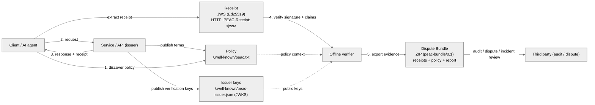

<p align="center">
  <a href="https://www.peacprotocol.org">
    <h1 align="center">PEAC Protocol</h1>
  </a>
</p>

<p align="center">
  <strong>Verifiable interaction records for AI agents and automated systems</strong>
  <br />
  A record is the portable interaction artifact; a receipt is the signed file format.
</p>

<p align="center">
  <a href="LICENSE"></a>
  <a href="https://github.com/peacprotocol/peac/releases"></a>
  <a href="https://www.npmjs.com/package/@peac/protocol"></a>
  <a href="https://github.com/peacprotocol/peac/actions/workflows/ci.yml"></a>
</p>

<p align="center">
  <a href="https://www.peacprotocol.org">Website</a> &middot;
  <a href="docs/SPEC_INDEX.md">Spec Index</a> &middot;
  <a href="https://github.com/peacprotocol/peac/discussions">Discussions</a> &middot;
  <a href="https://github.com/peacprotocol/peac/releases">Releases</a>
</p>

**What:** PEAC standardizes three artifacts: a discoverable policy file (`/.well-known/peac.txt`), a signed receipt format (Ed25519 JWS), and a portable evidence bundle for offline verification. The Interaction Record format (`interaction-record+jwt`) is the current stable receipt format on `latest`. Wire 0.1 (`peac-receipt/0.1`) remains frozen for backward compatibility.

**Who:** AI agents and agent platforms, APIs, gateways, tool servers, and compliance/security teams operating automated traffic across org boundaries.

**Why:** Internal logs don't travel across org boundaries and aren't neutral proof. PEAC makes terms machine-readable and outcomes cryptographically verifiable, without replacing your auth, rails, or observability.

## Why PEAC exists

**The problem:** AI agents and automated systems operate across organizational boundaries, but proof of what happened stays locked in internal logs. When billing errors, policy violations, or safety incidents arise, there's no neutral, portable evidence that both parties can verify.

**Traditional approaches:**

- **Internal logs** - Not portable, not verifiable by third parties
- **API observability** - Captures _how_ systems behave, not _what terms applied_
- **Audit trails** - Vendor-specific, can't be independently verified offline

**PEAC's approach:** Standardize machine-readable policies and cryptographically signed receipts that create verifiable evidence at interaction time. Verification is offline and deterministic; it doesn't require trusting the issuer's live systems.

**Enables:** Verifiable evidence for incident response and compliance. Billing disputes resolve with cryptographic proof. AI safety reviews have portable artifacts to analyze.

## The model


```mermaid
%%{init: {'theme':'neutral'} }%%
flowchart LR
  A["Client / AI agent"]
  S["Service / API (issuer)"]
  V["Offline verifier"]
  T["Third party (audit / dispute)"]

  P["Policy<br/>/.well-known/peac.txt"]
  K["Issuer keys<br/>/.well-known/peac-issuer.json (JWKS)"]
  R["Receipt<br/>JWS (Ed25519)<br/>HTTP: PEAC-Receipt: &lt;jws&gt;"]
  B["Dispute Bundle<br/>ZIP (peac-bundle/0.1)<br/>receipts + policy + report"]

  S -->|publish terms| P
  S -->|publish verification keys| K
  A -->|1. discover policy| P
  A -->|2. request| S
  S -->|3. response + receipt| A
  A -->|extract receipt| R
  R -->|4. verify signature + claims| V
  P -.->|policy context| V
  K -.->|public keys| V
  V -->|5. export evidence| B
  B -->|audit / dispute / incident review| T

  classDef actor stroke-width:2px
  classDef artifact stroke-width:2px
  classDef evidence stroke-width:2px
  class A,S,V,T actor
  class P,K,R artifact
  class B evidence
```

**The proof flow (per interaction):**

1. **Discover policy** - Agent reads `/.well-known/peac.txt` before making requests (machine-readable terms)
2. **Make request** - Client/agent calls API, tool, or dataset endpoint
3. **Receive signed receipt** - Service returns `PEAC-Receipt: <jws>` header with response (cryptographic proof of interaction)
4. **Verify offline** - Verifier checks JWS signature + claims using issuer's public keys (deterministic, no network required)
5. **Export evidence** - Bundle receipts + policy + verification report into portable `.zip` for audits, disputes, or incident review

**Setup (out of band):** Service publishes policy at `/.well-known/peac.txt` and verification keys at `/.well-known/peac-issuer.json`.

### What the artifacts look like

`/.well-known/peac.txt`: machine-readable terms (YAML):

```yaml
version: 'peac-policy/0.1'
usage: conditional
purposes: [crawl, index, inference]
receipts: required
attribution: required
rate_limit: '100/hour'
```

`PEAC-Receipt` header: signed proof returned on governed responses:

```text
PEAC-Receipt: eyJhbGciOiJFZERTQSIsInR5cCI6ImludGVyYWN0aW9uLXJlY29yZCtqd3QifQ...
```

The receipt is a standard JWS (Ed25519) that can be verified offline using the issuer's published keys. Full specification: [Spec Index](docs/SPEC_INDEX.md).

## Where it fits

- HTTP APIs (paid or permissioned), tool invocations, dataset downloads, long-running sessions
- Cross-org audit evidence (security, compliance, billing disputes)
- Crawls, indexing, and AI training access with verifiable terms
- Safety, incident response, and governance workflows that need verifiable evidence (what terms applied, what was requested, what happened)

**Complements existing systems:**

- **OpenTelemetry** - Observability traces; PEAC adds portable proof that correlates to those traces
- **MCP / A2A** - Tool coordination and agent exchanges; PEAC carries verifiable evidence alongside
- **AP2 / ACP / UCP** - Commerce authorization and orchestration; PEAC provides cryptographic proof of outcomes
- **Payment rails** - Fund movement; PEAC records settlement references and makes outcomes verifiable

This repository contains the **reference TypeScript implementation** and a **Go SDK** ([sdks/go/](sdks/go/)).

---

## Internal logs vs. portable receipts

| Property                   | Internal Logs             | Portable Receipts                           |
| -------------------------- | ------------------------- | ------------------------------------------- |
| **Portability**            | Locked in vendor systems  | Portable across orgs                        |
| **Verifiability**          | Trust the log owner       | Cryptographic proof (offline)               |
| **Machine-readable terms** | Human docs, maybe OpenAPI | `/.well-known/peac.txt` for agent discovery |
| **Dispute resolution**     | "My logs vs. your logs"   | Neutral evidence both parties verify        |

PEAC is the evidence layer. It records what happened in a format that survives organizational boundaries.

---

## Principles

- **Neutral by design:** Records what happened in a portable, verifiable format
- **Offline-verifiable:** Verification is deterministic and can run without network access
- **Interoperable:** Works alongside HTTP, MCP (stdio and Streamable HTTP), and A2A today; additional transport mappings for ACP, UCP, and x402
- **Privacy-aware:** Receipts are structured for auditability while supporting minimization and selective disclosure via bundles
- **Open source:** Apache-2.0 licensed, designed for multiple independent implementations

**Non-goals:** PEAC is not an auth system, not a payment rail, not observability infrastructure. It is the evidence layer that complements these systems.

PEAC produces portable, verifiable evidence that can feed AI safety reviews, incident response, and governance workflows.

---

## Quick start

**Requirements:** Tested on Node 24; compatible with Node 22+

```bash
pnpm add @peac/protocol @peac/crypto @peac/schema
```

### Issue and verify a receipt

```typescript
import { generateKeypair } from '@peac/crypto';
import { issue, verifyLocal } from '@peac/protocol';
import { getCommerceExtension } from '@peac/schema';

const { privateKey, publicKey } = await generateKeypair();

const { jws } = await issue({
  iss: 'https://api.example.com',
  kind: 'evidence',
  type: 'org.peacprotocol/payment',
  pillars: ['commerce'],
  extensions: {
    'org.peacprotocol/commerce': {
      payment_rail: 'x402',
      amount_minor: '1000',
      currency: 'USD',
    },
  },
  privateKey,
  kid: 'key-2026-03',
});

const result = await verifyLocal(jws, publicKey);
if (result.valid && result.wireVersion === '0.2') {
  const commerce = getCommerceExtension(result.claims);
  console.log(result.claims.kind, commerce?.currency);
}
```

### Verify an existing receipt (CLI)

```bash
peac verify 'eyJhbGciOiJFZERTQSIsInR5cCI6ImludGVyYWN0aW9uLXJlY29yZCtqd3QifQ...'
```

> **Legacy:** Wire 0.1 (`peac-receipt/0.1`) is frozen. See [examples/quickstart/](examples/quickstart/) for Wire 0.1 code.

See [examples/wire-02-minimal/](examples/wire-02-minimal/) for a runnable example. For settlement, HTTP/REST, Express middleware, and Go SDK examples, see [docs/README_LONG.md](docs/README_LONG.md).

---

## Choose your path

- **Agent developer**: [Quick start](#quick-start): issue and verify receipts in 5 lines
- **API operator**: [Express middleware](docs/README_LONG.md#express-middleware): add PEAC in 3 lines
- **Go developer**: [Go SDK](sdks/go/): issue, verify, and evaluate policy (Wire 0.1)
- **x402 / crypto payments**: [Stripe x402 profile](docs/profiles/stripe-x402-machine-payments.md): normalize + receipt + verify
- **Policy author**: [Policy Kit](docs/policy-kit/quickstart.md): author and validate terms
- **Auditor / compliance**: [Dispute Bundles](#core-primitives): portable evidence format
- **Protocol integrator**: [Spec Index](docs/SPEC_INDEX.md): normative specifications

---

## CLI

> Install: `pnpm add @peac/cli` or run from this repo: `pnpm --filter @peac/cli exec peac --help`.

```bash
peac verify 'eyJhbGc...'                # Verify a receipt
peac conformance run                     # Run conformance tests
peac conformance run --level full        # Full conformance suite
peac reconcile a.bundle b.bundle         # Merge and diff evidence bundles
peac samples list                        # List sample receipts
peac policy init                         # Create peac-policy.yaml
peac policy validate policy.yaml         # Validate policy syntax
peac policy generate policy.yaml         # Compile to deployment artifacts
```

See [packages/cli/README.md](packages/cli/README.md) for the full command reference.

---

## Core primitives

**Stable** = wire identifiers and spec are stable and conformance-gated; implementations may evolve.

| Primitive              | Stable | Description                                                              |
| ---------------------- | ------ | ------------------------------------------------------------------------ |
| Receipt envelope (0.1) | Frozen | `typ: peac-receipt/0.1`, Ed25519 JWS signature (legacy)                  |
| Receipt envelope (0.2) | Yes    | `typ: interaction-record+jwt`, 2 kinds, typed extensions, policy binding |
| Receipt header         | Yes    | `PEAC-Receipt: <jws>`                                                    |
| Policy surface         | Yes    | `/.well-known/peac.txt` access terms for agents                          |
| Issuer config          | Yes    | `/.well-known/peac-issuer.json` JWKS discovery                           |
| Verification report    | Yes    | Deterministic JSON output from verify operations                         |
| Dispute Bundle         | Yes    | ZIP with receipts + policy + report for offline audit                    |
| Workflow context       | Yes    | DAG correlation for multi-step agentic workflows                         |
| Conformance vectors    | Yes    | Golden inputs/outputs in `specs/conformance/`                            |

---

## Versioning

Two wire formats coexist:

- **Interaction Record format** (`interaction-record+jwt`, Wire 0.2): the current stable receipt format on the `latest` dist-tag (v0.12.0+). Adds structured kinds (`evidence`/`challenge`), open semantic types, multi-valued pillars, typed extension groups, and policy binding.
- **Wire 0.1** (`peac-receipt/0.1`): frozen legacy format. Supported for verification via internal `verifyLocalWire01()` but not exported from `@peac/protocol`.

`verifyLocal()` verifies the current stable format only: Wire 0.1 receipts return `E_UNSUPPORTED_WIRE_VERSION`. Use `issue()` to create receipts. Both formats use Ed25519 JWS signatures and the `PEAC-Receipt` header.

Wire format identifiers are independent of npm package versions. Protocol surfaces (`PEAC-Receipt` header, `/.well-known/peac.txt`, `/.well-known/peac-issuer.json`) are stable. Implementation APIs (`@peac/protocol`, `@peac/cli`) aim for stability; internal packages may change between releases.

See [docs/specs/VERSIONING.md](docs/specs/VERSIONING.md) for the versioning doctrine and [docs/specs/WIRE-0.2.md](docs/specs/WIRE-0.2.md) for the Interaction Record format specification.

---

## Security

- JWS signature verification required before trusting any receipt claim
- Key discovery via `/.well-known/peac-issuer.json` JWKS endpoints with SSRF guards and timeouts
- Kernel constraints enforce structural limits at issuance and verification (fail-closed)
- No silent network fallback for offline verification (fail-closed)
- Replay protection via nonce + timestamp validation
- Errors mapped to RFC 9457 Problem Details (no internal details exposed)
- OWASP Top 10 for Agentic Applications alignment: [OWASP-ASI-MAPPING.md](docs/security/OWASP-ASI-MAPPING.md)

See [SECURITY.md](.github/SECURITY.md) and [docs/specs/PROTOCOL-BEHAVIOR.md](docs/specs/PROTOCOL-BEHAVIOR.md).

---

## Documentation

| Document                                                            | Purpose                                           |
| ------------------------------------------------------------------- | ------------------------------------------------- |
| [Spec Index](docs/SPEC_INDEX.md)                                    | Normative specifications                          |
| [Interaction Record Spec](docs/specs/WIRE-0.2.md)                   | Receipt envelope, kinds, extensions               |
| [Architecture](docs/ARCHITECTURE.md)                                | Kernel-first design                               |
| [Kernel Constraints](docs/specs/KERNEL-CONSTRAINTS.md)              | Structural limits enforced at issue and verify    |
| [Policy Kit Quickstart](docs/policy-kit/quickstart.md)              | Policy authoring guide                            |
| [Profiles](docs/profiles/)                                          | Integration profiles (Stripe x402, etc.)          |
| [HTTP Transport Security](docs/security/HTTP-TRANSPORT-SECURITY.md) | MCP Streamable HTTP security model                |
| [Integrator Kits](integrator-kits/)                                 | Templates for ecosystem partners                  |
| [Engineering Guide](docs/engineering-guide.md)                      | Development patterns                              |
| [CI Behavior](docs/CI_BEHAVIOR.md)                                  | CI pipeline and gates                             |
| [Extended README](docs/README_LONG.md)                              | Package catalog, integration examples, layer maps |

---

## Contributing

Contributions are welcome. For substantial changes, please open an issue first to discuss the approach.

See `docs/SPEC_INDEX.md` for normative specifications and `docs/CI_BEHAVIOR.md` for CI guidelines.

---

## License

Apache-2.0. See [LICENSE](LICENSE). Contributions are licensed under Apache-2.0.

Stewardship: [Originary](https://www.originary.xyz/) and the open source community.

---

## Implementations

- **TypeScript** (this repo): `@peac/protocol`, `@peac/cli`, `@peac/sdk-js`
- **Go**: [sdks/go/](sdks/go/) issuance, verification, and policy evaluation (Wire 0.1)
- **MCP**: [MCP server](packages/mcp-server/) (5 tools) and [MCP carrier mapping](packages/mappings/mcp/)
- **A2A**: [A2A carrier mapping](packages/mappings/a2a/) for agent-to-agent evidence
- **HTTP middleware**: [Express](packages/middleware-express/) automatic receipt issuance
- **x402**: [x402 adapter](packages/adapters/x402/) for machine payment evidence

Building an implementation? [Open an issue](https://github.com/peacprotocol/peac/issues/new).

---

## Community

- **Source:** [https://github.com/peacprotocol/peac](https://github.com/peacprotocol/peac)
- **Website:** [https://www.peacprotocol.org](https://www.peacprotocol.org)
- **Issues:** Bug reports and feature requests via GitHub Issues
- **Discussions:** Design questions and ecosystem proposals via GitHub Discussions
- **Contact:** See [https://www.peacprotocol.org](https://www.peacprotocol.org) for working group and contact information

PEAC is designed for multiple independent implementations across languages and platforms. If you are building an implementation, SDK, or rail adapter, please open an issue so it can be linked from ecosystem documentation.
