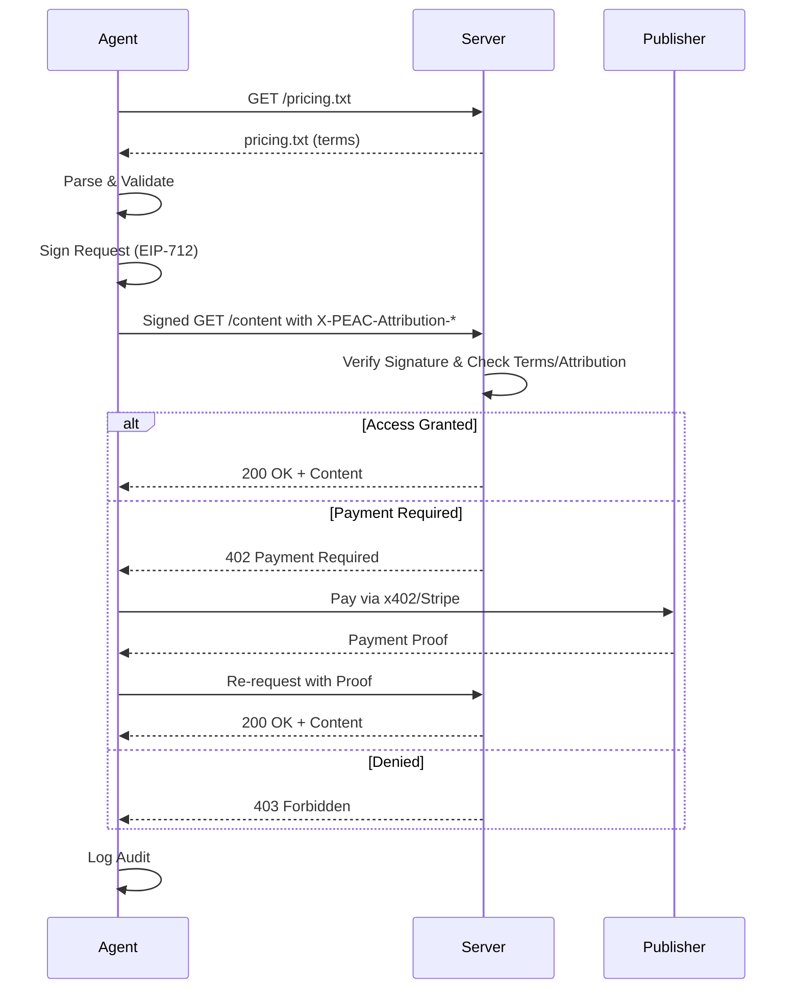

# PEAC Protocol Flow Diagram

Explainer: This diagram shows the core access lifecycle defined by the PEAC Protocol. It captures the programmable access control and economic enforcement between agents (e.g., AI crawlers), publishers (who set pricing/attribution terms), and servers (which verify and respond to signed requests). It supports both free and paid access, attribution, and signature validation under standardized consent conditions.

## Alt Text:
Sequence diagram showing agent requesting content, server enforcing pricing and attribution rules, and optional payment loop before access is granted.

## Long Description:
This is a flowchart showing how the PEAC Protocol operates during a typical web access interaction. The flow starts with an agent (e.g., AI bot) requesting pricing.txt from a server, parsing the file, and signing its request. The server verifies the request’s signature, deal terms, and attribution. If access is free and valid, content is returned. If access requires payment, the server returns a 402 response. The agent then pays the publisher (via x402 or other payment rails), provides payment proof, and retries the request. Upon validation, the server returns content. If the request violates terms or lacks required headers, the server responds with 403 Forbidden. All requests are logged for audit and dispute resolution.

## Node Links Table 
| Node      | Description                                | Relevant Field               |
| --------- | ------------------------------------------ | ---------------------------- |
| Agent     | Bot/crawler making access requests         | `agent_type`, `X-PEAC-*`     |
| Server    | Publisher's server enforcing PEAC terms    | `pricing.txt`, `checkAccess` |
| Publisher | Entity receiving payment, offering content | `contact`, `metadata`        |

## Narrative Walkthrough
1. Discovery Phase: The agent begins by fetching pricing.txt or .well-known/peac.json to understand the publisher’s access rules.

2. Preparation Phase: The agent validates the schema, signs the request using EIP-712 or another identity scheme, and attaches attribution and deal-related headers.

3. Request Phase: The signed request is sent to the server along with appropriate headers like X-PEAC-Attribution-Consent, X-PEAC-Signature, and optionally X-PEAC-Deal-ID.

4. Enforcement Phase: The server checks the agent’s signature, validates attribution compliance, enforces limits (e.g., request rate), and determines access level:

- If free and valid → 200 OK

- If paid → 402 Payment Required

- If non-compliant → 403 Forbidden

5. Settlement Phase (Optional): For paid content, the agent pays the publisher, obtains proof, and retries the request with evidence.

6. Audit Phase: Each transaction is logged, creating a cryptographically traceable audit trail useful for disputes, compliance, and future governance validation.