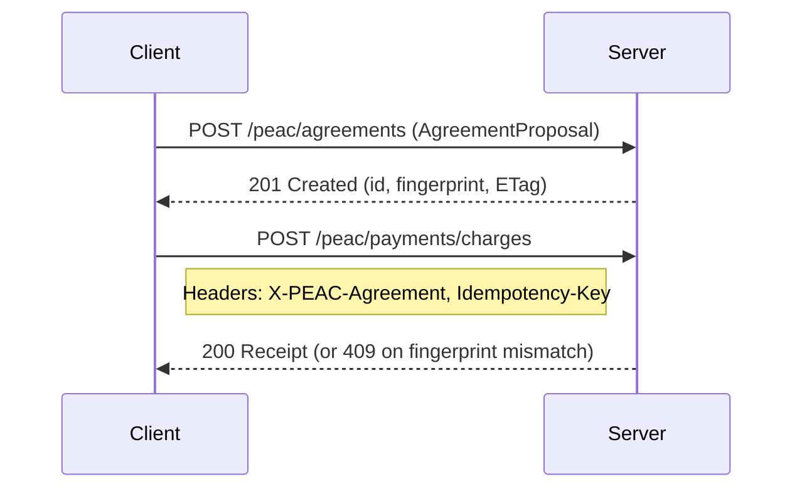

# @peacprotocol/server (v0.9.6)

**Agreement-first API server for the PEAC Protocol v0.9.6**

This reference server implements the modern PEAC Protocol with agreement-bound payments, RFC-compliant error handling, and comprehensive webhook support.

## Key Features

- **Agreement-first Architecture**: Create agreements first, bind payments second
- **RFC Compliance**: RFC 7807 Problem+JSON, RFC 9110 HTTP semantics
- **Secure Webhooks**: HMAC verification with replay protection
- **Payment Integration**: Mock provider + X402/Stripe support
- **Enterprise Ready**: Rate limiting, metrics, GDPR export, idempotency
- **Modern Headers**: X-PEAC-Protocol: 0.9.6, deprecation support

## Quick Start

### 1. Installation & Setup

```bash
# Install dependencies
npm install

# Build the server
npm run build

# Start with development settings
npm start
```

### 2. Create Your First Agreement

```bash
# Create an agreement
curl -X POST http://localhost:3000/peac/agreements \
  -H "Content-Type: application/json" \
  -H "X-PEAC-Protocol: 0.9.6" \
  -d '{
    "purpose": "AI model training",
    "consent": {"required": true},
    "attribution": {"required": false},
    "pricing_policy": {"price": "2500", "duration": 86400, "usage": "training"},
    "terms": {"text": "Training terms and conditions"}
  }'

# Response includes agreement ID and fingerprint:
# {"id": "agr_01H8...", "fingerprint": "abc123...", ...}
```

### 3. Process Agreement-Bound Payment

```bash
# Process payment with agreement binding
curl -X POST http://localhost:3000/peac/payments/charges \
  -H "Content-Type: application/json" \
  -H "X-PEAC-Protocol: 0.9.6" \
  -H "X-PEAC-Agreement: agr_01H8..." \
  -H "Idempotency-Key: payment_$(date +%s)" \
  -d '{
    "amount": "2500",
    "currency": "USD",
    "metadata": {"order_id": "order_123"}
  }'
```

## Migration from v0.9.3 → v0.9.6

### Breaking Changes

1. **Negotiation → Agreements**: `/peac/negotiate` is deprecated, use `/peac/agreements`
2. **Payment Binding**: All payments require `X-PEAC-Agreement` header
3. **Protocol Headers**: Use `X-PEAC-Protocol: 0.9.6` (not `X-PEAC-Version`)

### Flow: Agreement-first (v0.9.6)



**Code Migration:**

```javascript
// Before
const agreement = await client.negotiate(proposal);
const payment = await client.pay(amount);

// After
const agreement = await client.createAgreement(proposal);
const payment = await client.pay(amount, { agreementId: agreement.id });
```

## API Endpoints

| Method | Endpoint                         | Description                            |
| ------ | -------------------------------- | -------------------------------------- |
| `POST` | `/peac/agreements`               | Create agreement from proposal         |
| `GET`  | `/peac/agreements/{id}`          | Retrieve agreement with ETag caching   |
| `POST` | `/peac/payments/charges`         | Process agreement-bound payment        |
| `POST` | `/peac/negotiate`                | 🚫 Deprecated (use `/peac/agreements`) |
| `POST` | `/webhooks/peac`                 | Verify inbound webhooks                |
| `GET`  | `/.well-known/peac-capabilities` | Server capabilities                    |
| `GET`  | `/healthz`                       | Health check                           |
| `GET`  | `/metrics`                       | Prometheus metrics                     |

## Configuration

### Environment Variables

```bash
# Server
PEAC_PORT=3000                    # Server port
PEAC_LOG_LEVEL=info              # Logging level

# Infrastructure
PEAC_REDIS_URL=redis://localhost # Rate limiting & caching
PEAC_WEBHOOK_SECRET=your-secret  # Webhook HMAC verification

# Payments
PAYMENT_PROVIDER=mock            # mock|x402|stripe (use mock for testing)
X402_RPC_URL=...                # X402 provider RPC URL
STRIPE_SECRET_KEY=...           # Stripe integration
```

### Docker

```bash
# Production deployment
docker build -t peac-server .
docker run -p 3000:3000 \
  -e PEAC_REDIS_URL=redis://redis:6379 \
  -e PAYMENT_PROVIDER=mock \
  peac-server
```

## Testing

```bash
# Run all tests
npm test

# Test with coverage
npm test -- --coverage

# Integration tests only
npm run test:integration

# Type checking
npm run type-check
```

## RFC Compliance & Standards

- **RFC 7807**: Problem Details for HTTP APIs (all error responses)
- **RFC 9110**: HTTP Semantics (ETags, caching, conditional requests)
- **RFC 9331**: ULID specification (agreement IDs: `agr_...`)
- **Idempotency**: Idempotency-Key header support with TTL-based replay protection
- **Webhooks**: HMAC-SHA256 verification with canonical request signing

## License

Apache-2.0
